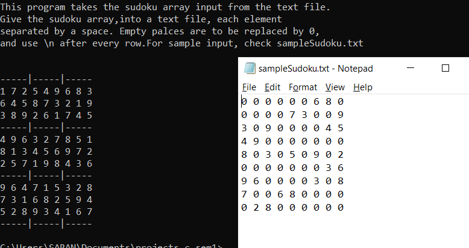

# Sudoku-solver

This program takes the sudoku array input from the text file.
Give the sudoku array into a text file, 
* each element separated by a space.
* Empty palces are to be replaced by 0.
* use \n after every row.

For sample input, please check sampleSudoku.txt

---
This is a sample execution.

